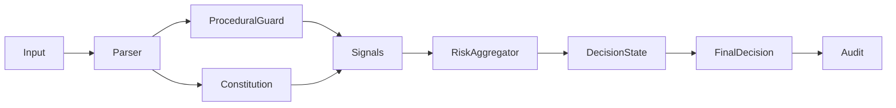

# ÆTHERYA – Deterministic Ethical Decision Core


A deterministic, risk-aware policy engine for evaluating actions under constitutional constraints and procedural safeguards.

Designed for reproducibility, auditability, and strict typing.

---

## Why

Most systems evaluate actions implicitly.  
ÆTHERYA makes evaluation explicit.

It separates:
- Principles (constitutional constraints)
- Signals (risk sources)
- Aggregation (decision logic)
- Execution state mapping
- Audit trail

This enables:
- Deterministic decisions
- Configurable thresholds
- Snapshot testing
- Explainable outcomes

---

## Architecture



## Core Components

### Constitution

Evaluates actions against defined principles.

Returns structured signals:
- `risk_score`
- `reason`
- `tags`
- `violated_principle`

### Procedural Guard

Detects critical operations (e.g., destructive commands).

### Risk Aggregator

Aggregates signals:
- Weighted scoring
- Mode-aware thresholds
- Deterministic outcome

### Decision

Snapshot-friendly output:
- `allowed`
- `risk_score`
- `reason`
- `violated_principle`
- `mode`

### Explainability Engine

Builds a deterministic justification graph per decision:
- per-signal weighted contribution
- graph nodes/edges from signals to aggregate and final state
- explicit transition from aggregate decision to final policy state

### LLM Provider (Shadow-Only)

Provider contract for non-authoritative telemetry:
- `LLMRequest` / `LLMResponse` typed contracts
- `LLMProvider` protocol
- `DryRunLLMProvider` for deterministic local simulations (no external calls)
- `OpenAILLMProvider` for real external shadow suggestions (`OPENAI_API_KEY`)
- `llm_shadow` mode in pipeline for non-executing telemetry
- `shadow_suggestion` + `ethical_divergence` trace for shadow-vs-core decision drift
- core decision authority remains in ÆTHERYA (LLM output never overrides `allowed`)

### Policy Decision Adapter (Decoupled Contract)

Future-proof adapter layer for external context engines (LLM, vector DB, etc.) without coupling runtime execution:
- `PolicyDecisionRequest` / `PolicyDecisionResponse` typed contracts
- `PolicySignalCandidate` and `PolicyDecisionCandidate` for external suggestions
- `PolicyDecisionAdapter` protocol + `ensure_policy_decision_adapter` contract guard
- `DryRunPolicyDecisionAdapter` deterministic reference implementation
- `policy_adapter_shadow` pipeline telemetry mode (no decision override, only projected-risk trace)

## Quality Guarantees

- Typed pipeline (mypy clean)
- Ruff + Black enforced
- Snapshot testing
- Coverage enforced (>=99%)
- CI validated on every push
- Dedicated `security_gate` CI job with release-time dependency (`release_readiness` on tags `v*`)
- Audit traceability with deterministic `decision_id` + `context_hash`
- Versioned baseline (`v0.5.0`)

## Installation

```bash
pip install -e ".[dev]"
```

Optional OpenAI shadow integration:

```bash
pip install -e ".[dev,llm]"
```

## Running tests

```bash
pytest --cov
```

Run dedicated stress suites:

```bash
pytest tests/test_audit_integrity_stress.py tests/test_audit_tamper_campaign.py tests/test_jailbreak_guard_stress.py tests/test_security_corpus_regression.py -q
```

Run versioned security baseline regression (single command used in local + CI):

```bash
make security_baseline
```

Run focused chaos tests:

```bash
pytest tests/test_audit_chaos_bytes.py tests/test_pipeline_policy_adapter_shadow.py -q
```

Run chaos benchmark with latency SLO thresholds:

```bash
make chaos_benchmark
```

Run deterministic pipeline latency benchmark (100-input SLO suite):

```bash
make pipeline_benchmark
```

Run randomized property/extreme tests (RiskAggregator + chaos paths):

```bash
make property_tests
```

Run release-artifact fuzzing + stronger phase2 mutation round:

```bash
make audit_fuzz
```

Run 10-minute memory soak over repeated pipeline benchmark loops:

```bash
make pipeline_memory_soak
```

Run LLM shadow tests (dry-run + OpenAI provider selection paths):

```bash
pytest tests/test_llm_provider.py tests/test_pipeline_llm_shadow.py -q
```

## OpenAI Shadow Mode

Policy snippet:

```yaml
llm_shadow:
  enabled: true
  provider: openai
  model: gpt-4o-mini
  temperature: 0.0
  max_tokens: 96
  timeout_sec: 10.0
```

Runtime requirements:
- `OPENAI_API_KEY` exported in environment
- optional dependency installed: `pip install -e ".[dev,llm]"`

Safety contract:
- OpenAI runs in `shadow-only`
- pipeline still decides `allowed` from deterministic core gates/aggregator
- LLM output is stored only under `context.llm_shadow`

## Render Explainability Graph

Generate Mermaid from the latest audit event:

```bash
python -m aetherya.explainability_render --audit-path audit/decisions.jsonl --event-index -1 --output audit/explainability_latest.mmd
```

If `--output` is omitted, Mermaid is printed to stdout.

Generate a static HTML report (summary + Mermaid graph):

```bash
python -m aetherya.explainability_report --audit-path audit/decisions.jsonl --event-index -1 --output audit/explainability_report.html --title "AETHERYA Audit Report"
```

## Verify Audit Attestation

Validate integrity (`context_hash`, `decision_id`) and cryptographic attestation:

```bash
python -m aetherya.audit_verify --audit-path audit/decisions.jsonl
```

Validate one event and emit JSON:

```bash
python -m aetherya.audit_verify --audit-path audit/decisions.jsonl --event-index -1 --json
```

Strict mode (rejects non-HMAC events):

```bash
AETHERYA_ATTESTATION_KEY="your-key" python -m aetherya.audit_verify --audit-path audit/decisions.jsonl --require-hmac
```

Strict chain-causality verification (detects reordered/sabotaged JSONL history):

```bash
AETHERYA_ATTESTATION_KEY="your-key" python -m aetherya.audit_verify --audit-path audit/decisions.jsonl --require-hmac --require-chain
```

## Security Gate

Run the 3-phase release gate:
- corpus regression against expected snapshots
- deterministic integrity fuzz campaign (1,000 events)
- signed release manifest

```bash
AETHERYA_ATTESTATION_KEY="your-key" python -m aetherya.security_gate --phase2-events 1000 --phase2-seed 1337 --phase2-mutation-rounds 32
```

Optional HTML reports for corpus failures:

```bash
AETHERYA_ATTESTATION_KEY="your-key" python -m aetherya.security_gate --failure-report-dir audit/security_gate/fail_reports
```

In CI, `security_gate` runs as an explicit job and tag releases (`v*`) are blocked unless both `test` and `security_gate` pass.

`chaos_tests` runs in a separate CI job and enforces latency SLOs over deterministic chaos runs:
- `p95 <= 12ms`
- `p99 <= 20ms`
- detection rate required = `1.0`

Each run uploads `audit/chaos/chaos_benchmark_metrics.json` as build artifact.

`pipeline_slo` runs independently in CI and enforces normal-operation latency SLOs over a deterministic 100-input corpus:
- `p95 <= 10ms`
- `p99 <= 15ms`

`release_readiness` now validates signed artifacts (`security_manifest.json`) with strict checks:
- manifest must be present and non-empty
- HMAC signature must be valid
- `commit_sha` must match release commit
- `decision_count` must match expected corpus size and phase1 audit line count

Manual verification command:

```bash
AETHERYA_ATTESTATION_KEY="your-key" GITHUB_SHA="$(git rev-parse HEAD)" python -m aetherya.verify_release_artifacts --manifest-path audit/security_gate/security_manifest.json --phase1-audit-path audit/security_gate/phase1_corpus_audit.jsonl
```

## Versioned Security Baseline

`security_baseline` validates deterministic stress metrics against a versioned snapshot:
- jailbreak attack/benign regression rates
- audit integrity tamper detection baseline
- deterministic fuzz campaign mismatch profile

Snapshot path:
- `tests/fixtures/security_baseline/v1/stress_baseline.json`

CLI:

```bash
python -m aetherya.security_baseline --baseline-path tests/fixtures/security_baseline/v1/stress_baseline.json
```

Update snapshot intentionally:

```bash
python -m aetherya.security_baseline --update-baseline
```

## Status

`v0.5.0` – Stable security-hardened baseline with deterministic policy pipeline, explainability, release artifact attestation, and pipeline latency SLO gate.

See [CHANGELOG.md](./CHANGELOG.md) for release details.

## Design Principles

- Determinism over heuristics
- Explicit evaluation over implicit behavior
- Strict typing over dynamic shortcuts
- Reproducibility over magic
- Auditability as a first-class concern
