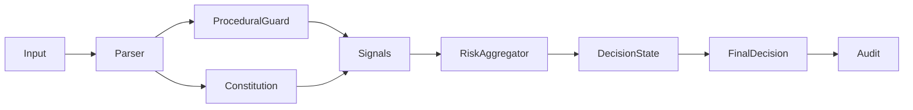

# ÆTHERYA – Deterministic Ethical Decision Core


A deterministic, risk-aware policy engine for evaluating actions under constitutional constraints and procedural safeguards.

Designed for reproducibility, auditability, and strict typing.

---

## Why

Most systems evaluate actions implicitly.  
ÆTHERYA makes evaluation explicit.

It separates:
- Principles (constitutional constraints)
- Signals (risk sources)
- Aggregation (decision logic)
- Execution state mapping
- Audit trail

This enables:
- Deterministic decisions
- Configurable thresholds
- Snapshot testing
- Explainable outcomes

---

## Architecture



## Core Components

### Constitution

Evaluates actions against defined principles.

Returns structured signals:
- `risk_score`
- `reason`
- `tags`
- `violated_principle`

### Procedural Guard

Detects critical operations (e.g., destructive commands).

### Risk Aggregator

Aggregates signals:
- Weighted scoring
- Mode-aware thresholds
- Deterministic outcome

### Decision

Snapshot-friendly output:
- `allowed`
- `risk_score`
- `reason`
- `violated_principle`
- `mode`

## Quality Guarantees

- Typed pipeline (mypy clean)
- Ruff + Black enforced
- Snapshot testing
- Coverage enforced (>90%)
- CI validated on every push
- Versioned baseline (`v0.1.0`)

## Installation

```bash
pip install -e ".[dev]"
```

## Running tests

```bash
pytest --cov
```

## Status

`v0.1.0` – Stable baseline with deterministic policy pipeline.

## Design Principles

- Determinism over heuristics
- Explicit evaluation over implicit behavior
- Strict typing over dynamic shortcuts
- Reproducibility over magic
- Auditability as a first-class concern
