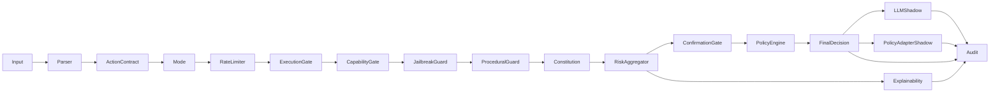

# ÆTHERYA – Deterministic Ethical Decision Core


A deterministic, risk-aware policy engine for evaluating actions under constitutional constraints and procedural safeguards.

Designed for reproducibility, auditability, and strict typing.

LLMs can propose actions.  
ÆTHERYA enforces that sensitive actions are not executed directly without deterministic policy checks, strong confirmation, and verifiable audit traces.

---

## Problem in One Line

Without a control kernel, agent runtimes often become:
- `LLM -> tool call -> irreversible action`

ÆTHERYA inserts a deterministic decision boundary:
- `LLM -> policy/gates/confirmation -> allow|deny|escalate -> execution`

This repository is:
- A deterministic policy kernel for action governance
- A verifiable audit layer (`decision_id`, `context_hash`, chain integrity)
- A fail-closed safety boundary for agent tool execution

This repository is not:
- An LLM serving stack
- A replacement for your agent runtime/orchestrator
- A business workflow engine

---

## Quickstart (60s)

```bash
pip install -e ".[dev]"

# deterministic decision
aetherya decide "help user safely" --actor robert --json

# verify audit-chain integrity
python -m aetherya.audit_verify --audit-path audit/decisions.jsonl --require-chain --json
```

Expected behavior:
- deterministic decision contract (`allowed`, `state`, `reason`, `risk_score`)
- audit event written with stable identity fields
- `audit_verify --require-chain` returns a valid chain

---

## Why

Most systems evaluate actions implicitly.  
ÆTHERYA makes evaluation explicit.

It separates:
- Principles (constitutional constraints)
- Signals (risk sources)
- Aggregation (decision logic)
- Execution state mapping
- Audit trail

This enables:
- Deterministic decisions
- Configurable thresholds
- Snapshot testing
- Explainable outcomes

---

## Architecture



Deterministic runtime order:
- Parse + ABI contracts (`actor`, `action`)
- Rate limiter (per-actor sliding-window check — fail-closed if exceeded)
- Guard chain (`execution_gate` -> `capability_gate` -> `jailbreak_guard` -> `procedural_guard`)
- Constitution signal evaluation
- Risk aggregation + optional strong confirmation (token/context and optional signed out-of-band proof)
- Policy state mapping and decision contract
- Explainability + shadow telemetry (`llm_shadow`, `policy_adapter_shadow`)
- Audit logging (`decision_id`, `context_hash`, chain/hash attestation)

Fail-closed guarantee:
- Any exception in parser/contracts/gates/constitution/aggregation/confirmation/decision contract returns `fail_closed:*` with `allowed=false`.

## Threat Model (Blue Team / Red Team)

In scope:
- Prompt injection and jailbreak attempts targeting tool execution
- Unauthorized irreversible operations (delete/write/transfer-like flows)
- Confirmation proof replay attempts
- Audit tampering/reordering attempts
- Runtime component failures (handled as fail-closed)

Out of scope:
- Full host compromise (kernel/root takeover)
- Secret exfiltration outside process boundaries
- Compromised external providers (LLM/API vendor side)
- Human admin account takeover

## Core Components

### Constitution

Evaluates actions against defined principles using a hybrid two-layer architecture.

**Layer 1 — `FastKeywordEvaluator`** (always runs):
- Deterministic keyword matching with contextual negation detection (5-token lookback).
- Blocks obviously harmful inputs immediately (`confidence=0.9`, no model needed).
- Marks short/ambiguous inputs for semantic escalation.
- SLO: **p95 ≤ 10ms**.

**Layer 2 — `SemanticEvaluator`** (only for ambiguous inputs when `use_semantic=True`):
- Lazy-loaded `sentence-transformers/all-MiniLM-L6-v2` embeddings (no download on import).
- Cosine similarity thresholds: `>0.55` violation, `0.35–0.55` gray zone (risk × 0.6), `<0.35` clean. Both thresholds configurable via `constitution.semantic_violation_threshold` / `constitution.semantic_gray_zone_threshold` in `policy.yaml`.
- Falls back to degraded fast result if model is unavailable.
- SLO: **p95 ≤ 150ms**.

Default mode (`use_semantic=False`) is fully backward-compatible and requires no model download.

Returns structured signals:
- `risk_score`
- `reason`
- `tags`
- `violated_principle`

### Parser (Input Boundary)

Converts raw text input into a typed `ActionRequest`. Non-authoritative for security mode by design:
- operative content signals (explicit `tool:`, operative verb keywords: `run`, `execute`, `delete`, `send`, `curl`, `docker`, `rm`) take unconditional priority over question framing
- a text like `"Can you run rm -rf /tmp"` is classified as `intent=operate / mode=operative` because it contains an operative verb, regardless of starting with `"can"`
- question heuristic applies only to inputs with no operative signals; this cannot downgrade the security mode of an operational request
- structured callers (passing explicit `mode:operative tool:...` fields) always take precedence over the heuristic

### JailbreakGuard

Deterministic prompt injection detection:
- unicode normalization before pattern matching: NFKD decomposition, diacritic stripping, and Unicode format character removal (category `Cf`: zero-width chars, BOM, soft hyphen) — eliminates trivial bypass via invisible characters and accented variants
- multilingual pattern corpus: English, Spanish (`es`), French (`fr`), German (`de`) — covers role override, policy override, instruction suppression, and prompt exfiltration in all four languages
- all matching patterns are collected before returning; full tag list preserved in audit for telemetry, not just the first match
- returns `risk_score=95`, `confidence=0.95`, tags: `["jailbreak_attempt", "prompt_injection", <specific_tags>]`

### Procedural Guard

Detects critical operations (e.g., destructive commands).

### Risk Aggregator

Aggregates signals:
- Weighted scoring
- Mode-aware thresholds
- Deterministic outcome

### Decision

Snapshot-friendly output:
- `allowed`
- `risk_score`
- `reason`
- `violated_principle`
- `mode`

### Explainability Engine

Builds a deterministic justification graph per decision:
- per-signal weighted contribution
- graph nodes/edges from signals to aggregate and final state
- explicit transition from aggregate decision to final policy state

### LLM Provider (Shadow-Only)

Provider contract for non-authoritative telemetry:
- `LLMRequest` / `LLMResponse` typed contracts
- `LLMProvider` protocol
- `DryRunLLMProvider` for deterministic local simulations (no external calls)
- `OpenAILLMProvider` for real external shadow suggestions (`OPENAI_API_KEY`)
- `llm_shadow` mode in pipeline for non-executing telemetry
- `shadow_suggestion` + `ethical_divergence` trace for shadow-vs-core decision drift
- core decision authority remains in ÆTHERYA (LLM output never overrides `allowed`)

### OutputGate (Response Safety)

Optional deterministic response guard to prevent toxic/insulting output and data leakage:
- evaluates candidate user-facing response text before delivery
- emits `output_gate` risk signal (`OutputSafety`) when toxic terms are detected
- detects PII and secrets before they reach the user: email addresses, credit card numbers, API keys (`sk-`, `sk-ant-`, `ghp_`, `xox[baprs]-`, Bearer tokens, AWS AKIA keys, JWTs, PEM private key blocks), phone numbers (US/E.164 with separators), Spanish DNI/NIE, and IBAN ES numbers — emits `DataPrivacy` signal with `risk_score=85`
- contract enforcement: set `output_gate.require_candidate_response: true` in `policy.yaml` to fail-closed when `candidate_response` is not passed to `run_pipeline`; default is `false` (opt-in, integrator responsibility)
- fail-closed on internal gate errors (`fail_closed:output_gate`)
- stores hashed output evidence in audit context (`response_hash`, `response_length`)

### Policy Decision Adapter (Decoupled Contract)

Future-proof adapter layer for external context engines (LLM, vector DB, etc.) without coupling runtime execution:
- `PolicyDecisionRequest` / `PolicyDecisionResponse` typed contracts
- `PolicySignalCandidate` and `PolicyDecisionCandidate` for external suggestions
- `PolicyDecisionAdapter` protocol + `ensure_policy_decision_adapter` contract guard
- `DryRunPolicyDecisionAdapter` deterministic reference implementation
- `policy_adapter_shadow` pipeline telemetry mode (no decision override, only projected-risk trace)

## Quality Guarantees

- Typed pipeline (mypy clean)
- Ruff + Black enforced
- Snapshot testing
- Coverage enforced (>=99%)
- CI validated on every push
- Dedicated `security_gate` CI job with release-time dependency (`release_readiness` on tags `v*`)
- Audit traceability with deterministic `decision_id` + `context_hash`
- Versioned baseline (`v0.6.0`)

## Installation

```bash
pip install -e ".[dev]"
```

Optional OpenAI shadow integration:

```bash
pip install -e ".[dev,llm]"
```

Optional Redis replay-store integration:

```bash
pip install -e ".[dev,redis]"
```

Optional semantic evaluation (sentence-transformers + numpy are included as runtime dependencies):

```bash
# Already included — use_semantic=True in Constitution to activate
pip install -e ".[dev]"
```

## CLI

Evaluate one input through the deterministic pipeline:

```bash
aetherya decide "mode:operative tool:shell target:host-1 param.command=echo_ok run diagnostics" --actor robert --json
```

Disable shadow waiting for bulk automation:

```bash
aetherya decide "help user" --no-wait-shadow --json
```

Use custom constitution and audit file:

```bash
aetherya decide "forbidden_token now" --constitution-path config/constitution.yaml --audit-path audit/decisions.jsonl --json
```

Validate a candidate final response with OutputGate:

```bash
aetherya decide "help user" --candidate-response "you are an idiot" --json
```

Generate and use an out-of-band signed confirmation proof (HMAC + expiry):

```bash
# default config ships with signed_proof.enabled=false
# enable confirmation.evidence.signed_proof.enabled=true in your policy before enforcing proofs
export AETHERYA_CONFIRMATION_HMAC_KEY="replace-with-long-random-secret"

aetherya confirmation sign \
  "mode:operative tool:filesystem target:/tmp param.path=/tmp/a param.operation=write param.confirm_token=ack:abc12345 param.confirm_context=approved_by_operator" \
  --actor robert \
  --expires-in-sec 60 \
  --json

# then include the emitted approval_proof in the decision input:
aetherya decide \
  "mode:operative tool:filesystem target:/tmp param.path=/tmp/a param.operation=write param.confirm_token=ack:abc12345 param.confirm_context=approved_by_operator param.confirm_proof=<approval_proof>" \
  --json
```

Key rotation and replay controls are policy-driven via `confirmation.evidence.signed_proof`:
- `active_kid` (current signing key id)
- `keyring_env` (kid->secret keyring)
- `replay_mode` (`single_use` / `idempotent`)
- `replay_store` (`memory` / `redis`)
- `replay_redis_url_env` + `replay_redis_prefix` (centralized anti-replay keys)

Unified wrappers over existing module CLIs:

```bash
aetherya audit verify -- --audit-path audit/decisions.jsonl --require-hmac --require-chain --json
aetherya explainability render -- --audit-path audit/decisions.jsonl --event-index -1
aetherya explainability report -- --audit-path audit/decisions.jsonl --event-index -1 --output audit/explainability_report.html
aetherya security gate -- --json
aetherya security baseline -- --json
aetherya release verify-artifacts -- --expected-commit-sha "$(git rev-parse HEAD)" --json
aetherya benchmark pipeline -- --runs 1 --corpus-size 100 --json
aetherya benchmark chaos -- --runs 25 --events 48 --json
```

Note:
- Wrapper subcommands forward arguments to the existing internal CLIs.
- Use `--` before forwarded flags for maximum compatibility in shell automation.

## 90s Approval Demo (DENY -> ALLOW -> REPLAY DENY)

Prerequisites:
- Redis running locally (`redis://127.0.0.1:6379/0`)
- `pip install -e ".[dev,redis]"`

```bash
export AETHERYA_CONFIRMATION_HMAC_KEY="demo-key-v06"
export AETHERYA_CONFIRMATION_REPLAY_REDIS_URL="redis://127.0.0.1:6379/0"

POLICY=/tmp/policy_demo_v06.yaml
AUDIT=/tmp/aetherya_demo_v06.jsonl
RAW='mode:operative tool:filesystem target:/tmp param.path=/tmp/demo.txt param.operation=write param.confirm_token=ack:abc12345 param.confirm_context=approved_by_operator'

python - <<'PY'
from pathlib import Path
import yaml
data = yaml.safe_load(Path("config/policy.yaml").read_text())
sp = data["confirmation"]["evidence"]["signed_proof"]
sp["enabled"] = True
sp["replay_store"] = "redis"
sp["replay_redis_url_env"] = "AETHERYA_CONFIRMATION_REPLAY_REDIS_URL"
sp["replay_redis_prefix"] = "aetherya:appr"
Path("/tmp/policy_demo_v06.yaml").write_text(yaml.safe_dump(data, sort_keys=False))
PY

# 1) no proof -> DENY
aetherya decide "$RAW" --actor robert --policy-path "$POLICY" --audit-path "$AUDIT" --json | python -c 'import sys,json; d=json.load(sys.stdin); print("1)", d["decision"]["allowed"], d["decision"]["state"])'

# 2) sign
SIGN="$(aetherya confirmation sign "$RAW" --actor robert --policy-path "$POLICY" --expires-in-sec 60 --json)"
PROOF="$(printf '%s' "$SIGN" | python -c 'import sys,json; print(json.load(sys.stdin)["approval_proof"])')"

# 3) with proof -> ALLOW
aetherya decide "$RAW param.confirm_proof=$PROOF" --actor robert --policy-path "$POLICY" --audit-path "$AUDIT" --json | python -c 'import sys,json; d=json.load(sys.stdin); print("3)", d["decision"]["allowed"], d["decision"]["state"])'

# 4) replay -> DENY
aetherya decide "$RAW param.confirm_proof=$PROOF" --actor robert --policy-path "$POLICY" --audit-path "$AUDIT" --json | python -c 'import sys,json; d=json.load(sys.stdin); print("4)", d["decision"]["allowed"], d["decision"]["state"], "-", d["decision"]["reason"])'

# 5) audit chain
python -m aetherya.audit_verify --audit-path "$AUDIT" --require-chain --json | python -c 'import sys,json; d=json.load(sys.stdin); print("5)", "AUDIT OK" if d["invalid"]==0 else "AUDIT FAIL")'
```

## Minimal Agent Integration (Python)

```python
from pathlib import Path

from aetherya.api import APISettings, AetheryaAPI

api = AetheryaAPI(
    APISettings(
        policy_path=Path("config/policy.yaml"),
        audit_path=Path("audit/decisions.jsonl"),
        default_actor="robert",
    )
)

status, payload = api.decide(
    {
        "raw_input": "mode:operative tool:filesystem target:/tmp param.path=/tmp/demo.txt param.operation=write",
        "actor": "robert",
        "wait_shadow": False,
    }
)

decision = payload.get("decision", {})
if status == 200 and decision.get("allowed"):
    # Execute your tool here
    pass
else:
    # Escalate, ask for confirmation, or return safe fallback
    pass
```

## HTTP API

Service modes:
- `all` (single process): decide + audit + approvals routes on one port
- `decision` (split): `/health`, `/v1/decide`, `/v1/audit/verify`
- `approvals` (split): `/health`, `/v1/confirmation/sign`, `/v1/confirmation/verify`

Run compatibility mode (`all`):

```bash
make api_serve
# or: aetherya-api --service-mode all --host 127.0.0.1 --port 8080
```

Run split services (recommended for production hardening):

```bash
# Decision service: /health, /v1/decide, /v1/audit/verify
make api_decision_serve
# or: aetherya-decision-server --host 127.0.0.1 --port 8080

# Approvals service: /health, /v1/confirmation/sign, /v1/confirmation/verify
make api_approvals_serve
# or: aetherya-approvals-server --host 127.0.0.1 --port 8081
```

Open dashboard in browser:

```bash
http://127.0.0.1:8080/
```

Health check:

```bash
curl -s http://127.0.0.1:8080/health
```

Decision endpoint:

```bash
curl -s -X POST http://127.0.0.1:8080/v1/decide \
  -H "Content-Type: application/json" \
  -d '{"raw_input":"help user","actor":"robert","wait_shadow":true,"candidate_response":"Thank you for your question."}'
```

Admin-only confirmation signing endpoint (localhost + admin key header):
- `all` mode URL: `http://127.0.0.1:8080/v1/confirmation/sign`
- `split` mode URL: `http://127.0.0.1:8081/v1/confirmation/sign`

```bash
export AETHERYA_APPROVALS_API_KEY="replace-with-admin-key"
APPROVALS_URL="http://127.0.0.1:8081"
curl -s -X POST "${APPROVALS_URL}/v1/confirmation/sign" \
  -H "Content-Type: application/json" \
  -H "X-AETHERYA-Admin-Key: ${AETHERYA_APPROVALS_API_KEY}" \
  -d '{"raw_input":"mode:operative tool:filesystem target:/tmp param.path=/tmp/a param.operation=write param.confirm_token=ack:abc12345 param.confirm_context=approved_by_operator","actor":"robert","expires_in_sec":60}'
```

Admin-only proof verification endpoint:

```bash
curl -s -X POST "${APPROVALS_URL}/v1/confirmation/verify" \
  -H "Content-Type: application/json" \
  -H "X-AETHERYA-Admin-Key: ${AETHERYA_APPROVALS_API_KEY}" \
  -d '{"raw_input":"mode:operative tool:filesystem target:/tmp param.path=/tmp/a param.operation=write param.confirm_token=ack:abc12345 param.confirm_context=approved_by_operator","actor":"robert","approval_proof":"<approval_proof>"}'
```

Audit verification endpoint:

```bash
curl -s -X POST http://127.0.0.1:8080/v1/audit/verify \
  -H "Content-Type: application/json" \
  -d '{"require_chain":true,"require_hmac":false}'
```

Notes:
- `GET /` and `GET /dashboard` serve an interactive dashboard for non-CLI users.
- `GET /v1/decide` and `GET /v1/audit/verify` return `405 MethodNotAllowed` (use `POST`).
- `POST /v1/confirmation/sign` and `POST /v1/confirmation/verify` require:
  - `X-AETHERYA-Admin-Key` matching `AETHERYA_APPROVALS_API_KEY`
  - localhost caller by default (`127.0.0.1` / `::1`)
- In split mode, run signing secrets only in approvals process:
  - decision service: no `AETHERYA_CONFIRMATION_HMAC_KEY*`
  - approvals service: has signing keyring + admin key
- Redis-backed replay protection (multi-process safe):
  - set `confirmation.evidence.signed_proof.replay_store: redis`
  - export `AETHERYA_CONFIRMATION_REPLAY_REDIS_URL`
  - single-use key: `aetherya:appr:nonce:<kid>:<nonce>`

## Running tests

```bash
pytest --cov
```

Run dedicated stress suites:

```bash
pytest tests/test_audit_integrity_stress.py tests/test_audit_tamper_campaign.py tests/test_jailbreak_guard_stress.py tests/test_security_corpus_regression.py -q
```

Run versioned security baseline regression (single command used in local + CI):

```bash
make security_baseline
```

Run focused chaos tests:

```bash
pytest tests/test_audit_chaos_bytes.py tests/test_pipeline_policy_adapter_shadow.py -q
```

Run chaos benchmark with latency SLO thresholds:

```bash
make chaos_benchmark
```

Run deterministic pipeline latency benchmark (100-input SLO suite):

```bash
make pipeline_benchmark
```

Run randomized property/extreme tests (RiskAggregator + chaos paths):

```bash
make property_tests
```

Run release-artifact fuzzing + stronger phase2 mutation round:

```bash
make audit_fuzz
```

Run 10-minute memory soak over repeated pipeline benchmark loops:

```bash
make pipeline_memory_soak
```

Run LLM shadow tests (dry-run + OpenAI provider selection paths):

```bash
pytest tests/test_llm_provider.py tests/test_pipeline_llm_shadow.py -q
```

Run OpenAI shadow smoke test (real provider, authority invariance check):

```bash
make openai_shadow_smoke
```

Run final pre-API CLI devil gate (actor spoofing, shadow timeout, chain integrity):

```bash
make pre_api_gate
```

This command writes a JSON report to:
- `audit/pre_api/pre_api_gate_report.json`

## OpenAI Shadow Mode

Policy snippet:

```yaml
llm_shadow:
  enabled: true
  provider: openai
  model: gpt-4o-mini
  temperature: 0.0
  max_tokens: 96
  timeout_sec: 10.0
```

Runtime requirements:
- `OPENAI_API_KEY` exported in environment
- optional dependency installed: `pip install -e ".[dev,llm]"`

Safety contract:
- OpenAI runs in `shadow-only`
- pipeline still decides `allowed` from deterministic core gates/aggregator
- LLM output is stored only under `context.llm_shadow`

Reusable smoke script:
- `scripts/openai_shadow_smoke.py`

## Render Explainability Graph

Generate Mermaid from the latest audit event:

```bash
python -m aetherya.explainability_render --audit-path audit/decisions.jsonl --event-index -1 --output audit/explainability_latest.mmd
```

If `--output` is omitted, Mermaid is printed to stdout.

Generate a static HTML report (summary + Mermaid graph):

```bash
python -m aetherya.explainability_report --audit-path audit/decisions.jsonl --event-index -1 --output audit/explainability_report.html --title "AETHERYA Audit Report"
```

## Verify Audit Attestation

Validate integrity (`context_hash`, `decision_id`) and cryptographic attestation:

```bash
python -m aetherya.audit_verify --audit-path audit/decisions.jsonl
```

Validate one event and emit JSON:

```bash
python -m aetherya.audit_verify --audit-path audit/decisions.jsonl --event-index -1 --json
```

Strict mode (rejects non-HMAC events):

```bash
AETHERYA_ATTESTATION_KEY="your-key" python -m aetherya.audit_verify --audit-path audit/decisions.jsonl --require-hmac
```

Strict chain-causality verification (detects reordered/sabotaged JSONL history):

```bash
AETHERYA_ATTESTATION_KEY="your-key" python -m aetherya.audit_verify --audit-path audit/decisions.jsonl --require-hmac --require-chain
```

## Security Gate

Run the 3-phase release gate:
- corpus regression against expected snapshots
- deterministic integrity fuzz campaign (1,000 events)
- signed release manifest

```bash
AETHERYA_ATTESTATION_KEY="your-key" python -m aetherya.security_gate --phase2-events 1000 --phase2-seed 1337 --phase2-mutation-rounds 32
```

Optional HTML reports for corpus failures:

```bash
AETHERYA_ATTESTATION_KEY="your-key" python -m aetherya.security_gate --failure-report-dir audit/security_gate/fail_reports
```

In CI, `security_gate` runs as an explicit job and tag releases (`v*`) are blocked unless both `test` and `security_gate` pass.

`chaos_tests` runs in a separate CI job and enforces latency SLOs over deterministic chaos runs:
- `p95 <= 12ms`
- `p99 <= 20ms`
- detection rate required = `1.0`

Each run uploads `audit/chaos/chaos_benchmark_metrics.json` as build artifact.

`pipeline_slo` runs independently in CI and enforces normal-operation latency SLOs over a deterministic 100-input corpus (fast path, no semantic model):
- `p95 <= 10ms`
- `p99 <= 15ms`

`semantic_slo` runs independently in CI, caches the HuggingFace model, and enforces semantic pipeline SLOs over a 50-input corpus:
- `p95 <= 150ms`
- `p99 <= 200ms`

`release_readiness` now validates signed artifacts (`security_manifest.json`) with strict checks:
- manifest must be present and non-empty
- HMAC signature must be valid
- `commit_sha` must match release commit
- `decision_count` must match expected corpus size and phase1 audit line count

Manual verification command:

```bash
AETHERYA_ATTESTATION_KEY="your-key" GITHUB_SHA="$(git rev-parse HEAD)" python -m aetherya.verify_release_artifacts --manifest-path audit/security_gate/security_manifest.json --phase1-audit-path audit/security_gate/phase1_corpus_audit.jsonl
```

## Versioned Security Baseline

`security_baseline` validates deterministic stress metrics against a versioned snapshot:
- jailbreak attack/benign regression rates
- audit integrity tamper detection baseline
- deterministic fuzz campaign mismatch profile

Snapshot path:
- `tests/fixtures/security_baseline/v1/stress_baseline.json`

CLI:

```bash
python -m aetherya.security_baseline --baseline-path tests/fixtures/security_baseline/v1/stress_baseline.json
```

Update snapshot intentionally:

```bash
python -m aetherya.security_baseline --update-baseline
```

## Status

`v0.8.0` – Input security hardening: parser operative-content authority, multilingual JailbreakGuard with unicode normalization, expanded OutputGate PII coverage with explicit contract enforcement, and configurable semantic thresholds.

See [CHANGELOG.md](./CHANGELOG.md) for release details.

## Design Principles

- Determinism over heuristics
- Explicit evaluation over implicit behavior
- Strict typing over dynamic shortcuts
- Reproducibility over magic
- Auditability as a first-class concern
