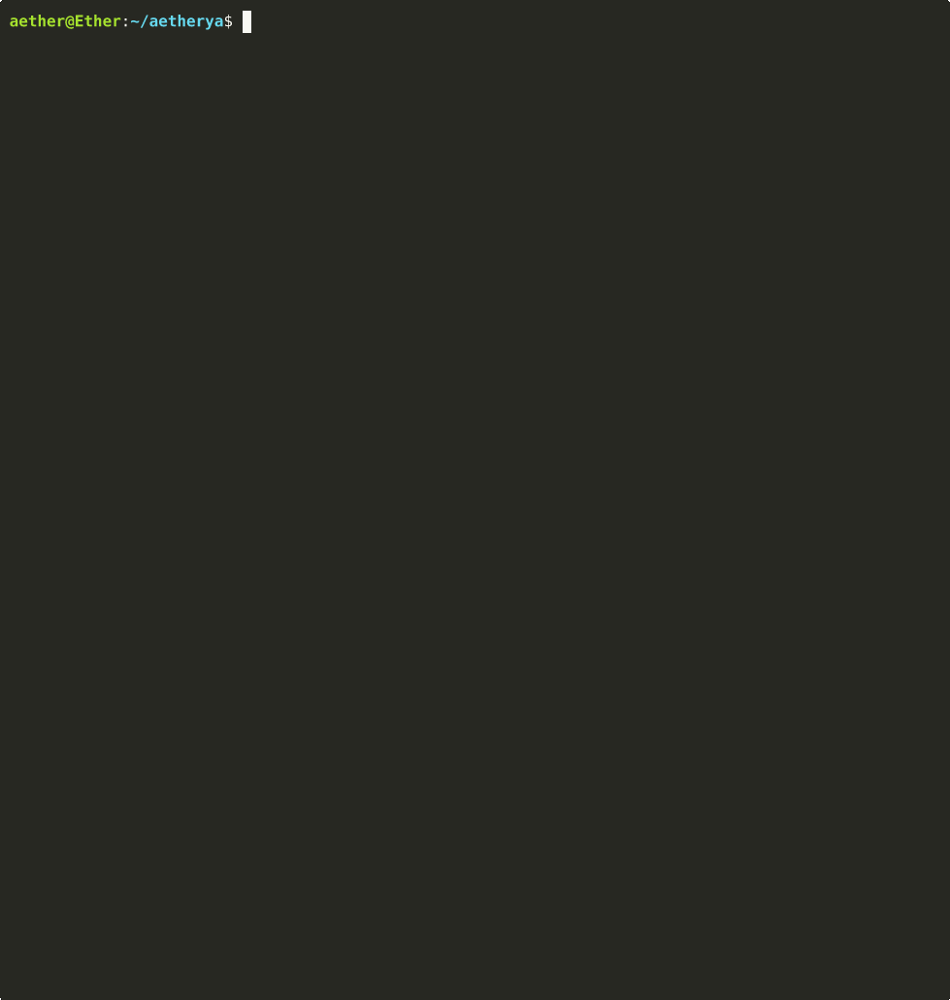

# ÆTHERYA – Deterministic Ethical Decision Core


A deterministic, risk-aware policy engine that sits between an LLM and any sensitive action.

---

## Problem

An agent with tools decides for itself what is safe to run. The component that
proposes the action and the component that authorises it are the same one — and
it is the easiest part of the system to talk into something. A paragraph in a
document it reads can change its mind.

```
LLM → tool call → irreversible action
```

## Solution

A boundary the model does not participate in:

```
LLM → policy · gates · confirmation → allow | deny | escalate → execution
```

Same input and same policy produce the same decision, always. No LLM sits in the
decision path — you do not ask a model whether something is dangerous, you
evaluate it against rules you can read, test and version.

It is not a smarter guard. It is a circuit breaker: it does not understand
electricity, it trips at a threshold every time, and you can press a button to
check that it still works.

---

## This repository is / is not

**Is:**
- A deterministic policy kernel for action governance
- A verifiable audit layer (`decision_id`, `context_hash`, chain integrity)
- A fail-closed safety boundary for agent tool execution
- An operator console for the human half of that boundary

**Is not:**
- An LLM serving stack
- A replacement for your agent runtime or orchestrator
- A sandbox — ÆTHERYA decides; execution isolation is a complementary concern
- A business workflow engine

---



---

## Quickstart

```bash
pip install -e ".[dev]"

# Evaluate an action
aetherya decide "help user safely" --actor robert --json

# Verify audit-chain integrity
python -m aetherya.audit_verify --audit-path audit/decisions.jsonl --require-chain --json
```

### In front of a real agent

The whole stack — engine, console, gateway, Redis — comes up with one command:

```bash
cp .env.example .env && cp .env.provider.example .env.provider   # fill in the keys
docker compose up -d --build
```

| Service | Port | What it is |
|---|---|---|
| decision | `127.0.0.1:8080` | HTTP API and the [operator console](#operator-console) |
| gateway | `127.0.0.1:8090` | OpenAI-compatible provider, see below |
| redis | `127.0.0.1:6379` | shared rate-limit and replay state |

Everything binds to loopback. The gateway holds your provider key and
authenticates nobody; the console exposes every recorded action. Neither port
belongs on a network.

---

## Governing an agent you did not write

The sidecar pattern requires editing the agent loop. Most runtimes — OpenClaw,
LiteLLM, LangChain — cannot be edited that way, or you do not want to fork them.

The gateway changes what the agent talks to instead of what it does. It speaks
the OpenAI chat-completions protocol, so the runtime treats it as a provider:

```
your agent ──► ÆTHERYA gateway ──► OpenAI | Anthropic
                     │
                every tool call the model proposes is ruled on
                before the agent ever sees it
```

Integration is a config change; the agent is not modified. A refused call is
removed from the response and replaced with a line explaining why, so the model
can replan — a silently dropped call just gets retried.

Two properties worth knowing:

- **The agent never sees your provider key.** The gateway holds it.
- **Tool results are checked too.** A tool that hands back API keys or private
  keys is caught on the way to the model, because gating what an agent *asks
  for* says nothing about what it *gets back*.

See **[docs/gateway-openclaw.md](docs/gateway-openclaw.md)** for the config and
the costs (streaming buffers; a verdict needs the whole tool call).

---

## Rollout phases

You do not know your false-positive rate, and no synthetic corpus can tell you —
the distribution that matters is your agents, your tools, your paths.

| Phase | Blocks | Confirms | Risk of deploying it |
|---|---|---|---|
| 1 — shadow | nothing | nothing | none: behaviour is unchanged |
| 2 — hard-deny | `hard_deny` | nothing | refuses only deterministic tag hits |
| 3 — full | `hard_deny`, `deny` | `escalate` | introduces human latency |

The phase is configuration, not code. Phase 1 records every decision and
executes everything anyway, which is what turns "we think the policy is right"
into a measurement.

```bash
aetherya rollout report --audit-path audit/decisions.jsonl
```

Reports the exit criteria, lists the `hard_deny` events awaiting human review,
maps the vocabulary your agent actually speaks, and exits non-zero until the
phase is ready. See **[docs/rollout-phases.md](docs/rollout-phases.md)**.

### Before changing the policy

```bash
aetherya policy replay --candidate config/policy.next.yaml \
                       --audit-path audit/decisions.jsonl
```

Replays a candidate against decisions you have already seen and against the
adversarial corpus, and reports what moves: stricter (friction), looser (where a
regression hides), and any attack the candidate stops refusing. Exits non-zero
only on the last.

---

## Operator console

`http://127.0.0.1:8080` — the human half of the boundary.

- **Decision feed** straight from the audit trail, filterable by state
- **Phase readiness** with each exit criterion and its verdict
- **Hard-deny review** — mark each event a true or false positive. This is what
  lets `hard_deny_reviewed` pass; the tool can count them, only a human can
  judge them. A false positive blocks the advance rather than clearing it.
- **Approval queue** — actions held for a human in phase 3. Approving mints a
  signed proof scoped to that exact action.

Server-rendered, no build step, no external assets: it ships in the same
container as the engine, so the audit trail sits behind one network boundary
instead of two.

---

## Pipeline

```
Input → Parser → IntentEscalation → RateLimiter → ExecutionGate
      → CapabilityGate → JailbreakGuard → ProceduralGuard → Constitution
      → OutputGate → RiskAggregator → ConfirmationGate → PolicyEngine
      → Decision → Explainability → Audit
```

Fail-closed: any exception in any stage → `allowed=false`.

**IntentEscalation** decouples the guard chain from the parser: `ExecutionGate`
and `CapabilityGate` only evaluate `operate` requests, so a command the parser
did not recognise would otherwise skip them entirely. Escalation is monotone —
it only ever tightens. See [docs/security-model.md](docs/security-model.md).

**Tool vocabulary.** Runtimes name the same capability differently — OpenClaw's
`exec` is what this policy calls `shell`. `tool_aliases` translates at the policy
root so every gate agrees, while the audit trail keeps the name the agent used.

**Determinism.** The keyword/guard/policy path is fully deterministic. The
optional semantic layer is the one learned component, and it is deliberately
non-authoritative: its risk is capped below every mode's `deny_at`, so it can
escalate to a human but never deny on its own. It is also never allowed to block
a decision on a cold model load — run `aetherya warmup` at startup to enable it.

**Latency.** p95 ≤ 10 ms, p99 ≤ 15 ms, enforced in CI. Measured at 0.2 ms.

---

## Approval Demo (DENY → SIGN → ALLOW → REPLAY DENY → AUDIT OK)

Prerequisites: Redis running locally, `pip install -e ".[dev,redis]"`.

```bash
export AETHERYA_CONFIRMATION_HMAC_KEY="demo-key-v06"
export AETHERYA_CONFIRMATION_REPLAY_REDIS_URL="redis://127.0.0.1:6379/0"

POLICY=/tmp/policy_demo_v06.yaml
AUDIT=/tmp/aetherya_demo_v06.jsonl
RAW='mode:operative tool:filesystem target:/tmp param.path=/tmp/demo.txt param.operation=write param.confirm_token=ack:abc12345 param.confirm_context=approved_by_operator'

python - <<'PY'
from pathlib import Path
import yaml
data = yaml.safe_load(Path("config/policy.yaml").read_text())
sp = data["confirmation"]["evidence"]["signed_proof"]
sp["enabled"] = True
sp["replay_store"] = "redis"
sp["replay_redis_url_env"] = "AETHERYA_CONFIRMATION_REPLAY_REDIS_URL"
sp["replay_redis_prefix"] = "aetherya:appr"
Path("/tmp/policy_demo_v06.yaml").write_text(yaml.safe_dump(data, sort_keys=False))
PY

# 1) No proof → DENY
aetherya decide "$RAW" --actor robert --policy-path "$POLICY" --audit-path "$AUDIT" --json \
  | python -c 'import sys,json; d=json.load(sys.stdin); print("1)", d["decision"]["allowed"], d["decision"]["state"])'

# 2) Sign
SIGN="$(aetherya confirmation sign "$RAW" --actor robert --policy-path "$POLICY" --expires-in-sec 60 --json)"
PROOF="$(printf '%s' "$SIGN" | python -c 'import sys,json; print(json.load(sys.stdin)["approval_proof"])')"

# 3) With proof → ALLOW
aetherya decide "$RAW param.confirm_proof=$PROOF" --actor robert --policy-path "$POLICY" --audit-path "$AUDIT" --json \
  | python -c 'import sys,json; d=json.load(sys.stdin); print("3)", d["decision"]["allowed"], d["decision"]["state"])'

# 4) Replay → DENY
aetherya decide "$RAW param.confirm_proof=$PROOF" --actor robert --policy-path "$POLICY" --audit-path "$AUDIT" --json \
  | python -c 'import sys,json; d=json.load(sys.stdin); print("4)", d["decision"]["allowed"], d["decision"]["state"], "-", d["decision"]["reason"])'

# 5) Audit chain
python -m aetherya.audit_verify --audit-path "$AUDIT" --require-chain --json \
  | python -c 'import sys,json; d=json.load(sys.stdin); print("5)", "AUDIT OK" if d["invalid"]==0 else "AUDIT FAIL")'
```

---

## Testing

1481 tests, 100% coverage enforced in CI, mypy strict, ruff and black clean.

```bash
make check                # fmt, lint, type, coverage
make security_baseline    # regression against a versioned decision snapshot
make chaos_benchmark      # detection rate 1.0 under fault injection
make pipeline_benchmark   # latency SLO
```

The adversarial corpus is a record of what got through before. Quote-split
command names, PowerShell equivalents of `rm -rf /`, uploads dressed as
downloads — each case is there because it once scored zero. See
**[docs/testing-and-benchmarks.md](docs/testing-and-benchmarks.md)**.

---

## Documentation

→ Full documentation index: **[docs/index.md](docs/index.md)**

| Topic | Link |
|-------|------|
| Architecture & pipeline | [docs/architecture.md](docs/architecture.md) |
| Security model & threat model | [docs/security-model.md](docs/security-model.md) |
| Policy model & constitution | [docs/policy-model.md](docs/policy-model.md) |
| Parser & input boundary | [docs/parser-and-input-boundary.md](docs/parser-and-input-boundary.md) |
| OutputGate & PII detection | [docs/output-gate.md](docs/output-gate.md) |
| HTTP API | [docs/api.md](docs/api.md) |
| Integrations (Python, CLI, agents) | [docs/integrations.md](docs/integrations.md) |
| Production rollout phases | [docs/rollout-phases.md](docs/rollout-phases.md) |
| Gateway for OpenClaw & other agents | [docs/gateway-openclaw.md](docs/gateway-openclaw.md) |
| Testing & benchmarks | [docs/testing-and-benchmarks.md](docs/testing-and-benchmarks.md) |
| Release & verification | [docs/release-and-verification.md](docs/release-and-verification.md) |

---

`v0.9.0` — See [CHANGELOG.md](./CHANGELOG.md) for release details.
