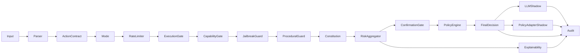

# Architecture

## Overview

ÆTHERYA inserts a deterministic decision boundary between an LLM and any sensitive action:

```
LLM → policy/gates/confirmation → allow|deny|escalate → execution
```

It separates:
- **Principles** — constitutional constraints
- **Signals** — risk sources (guard chain, constitution, confirmation state)
- **Aggregation** — deterministic decision logic
- **Execution state mapping** — policy engine output
- **Audit trail** — verifiable, tamper-evident log

This separation enables: deterministic decisions, configurable thresholds, snapshot testing, and explainable outcomes.

---

## Pipeline



Deterministic runtime order:

1. Parse + ABI contracts (`actor`, `action`)
2. Rate limiter (per-actor sliding-window — fail-closed if exceeded)
3. Guard chain: `execution_gate` → `capability_gate` → `jailbreak_guard` → `procedural_guard`
4. Constitution signal evaluation
5. Risk aggregation + optional confirmation (token/context and optional signed proof)
6. Policy state mapping and decision contract
7. Explainability + shadow telemetry (`llm_shadow`, `policy_adapter_shadow`)
8. Audit logging (`decision_id`, `context_hash`, chain/hash attestation)

**Fail-closed guarantee:** any exception in any stage returns `fail_closed:<stage>` with `allowed=false`.

---

## Components

### Risk Aggregator

Aggregates signals from all guards and the constitution:
- Weighted scoring
- Mode-aware thresholds (`consultive` vs `operative`)
- Hard-deny tags bypass the score entirely: `critical_tag_detected`, `jailbreak_attempt`, `tool_not_allowed`, `capability_tool_denied`
- Deterministic outcome given same config

### Decision Contract

Snapshot-friendly output:
- `allowed` — boolean
- `risk_score` — 0–100
- `reason` — string
- `violated_principle` — nullable
- `state` — `ALLOW | DENY | REQUIRE_CONFIRM | ESCALATE`
- `mode` — `consultive | operative`

### Explainability Engine

Builds a deterministic justification graph per decision:
- Per-signal weighted contribution
- Graph nodes/edges from signals to aggregate and final state
- Explicit transition from aggregate decision to final policy state

See [release-and-verification.md](./release-and-verification.md) for rendering commands.

### LLM Provider (Shadow-Only)

Provider contract for non-authoritative telemetry:
- `LLMRequest` / `LLMResponse` typed contracts
- `LLMProvider` protocol
- `DryRunLLMProvider` — deterministic, no external calls
- `OpenAILLMProvider` — real external shadow (`OPENAI_API_KEY`)
- `shadow_suggestion` + `ethical_divergence` trace for shadow-vs-core drift
- **Core decision authority remains in ÆTHERYA.** LLM output never overrides `allowed`.

### Policy Decision Adapter (Decoupled Contract)

Future-proof adapter for external context engines (LLM, vector DB) without coupling runtime execution:
- `PolicyDecisionRequest` / `PolicyDecisionResponse` typed contracts
- `PolicySignalCandidate` and `PolicyDecisionCandidate`
- `PolicyDecisionAdapter` protocol + `ensure_policy_decision_adapter` contract guard
- `DryRunPolicyDecisionAdapter` deterministic reference implementation
- `policy_adapter_shadow` pipeline mode — no decision override, projected-risk trace only

### Rate Limiter

Per-actor sliding-window check. **Single-process safeguard:** in multi-worker deployments (uvicorn `--workers N`), effective limit = N × `requests_per_window`.

---

## Design Principles

- Determinism over heuristics
- Explicit evaluation over implicit behavior
- Strict typing over dynamic shortcuts
- Reproducibility over magic
- Auditability as a first-class concern
