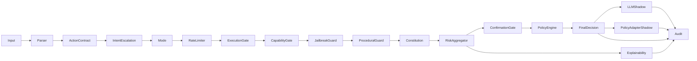

# Architecture

## Overview

ÆTHERYA inserts a deterministic decision boundary between an LLM and any sensitive action:

```
LLM → policy/gates/confirmation → allow|deny|escalate → execution
```

It separates:
- **Principles** — constitutional constraints
- **Signals** — risk sources (guard chain, constitution, confirmation state)
- **Aggregation** — deterministic decision logic
- **Execution state mapping** — policy engine output
- **Audit trail** — verifiable, tamper-evident log

This separation enables: deterministic decisions, configurable thresholds, snapshot testing, and explainable outcomes.

---

## Pipeline


```mermaid
flowchart LR
    Input --> Parser
    Parser --> ActionContract
    ActionContract --> IntentEscalation
    IntentEscalation --> Mode
    Mode --> RateLimiter
    RateLimiter --> ExecutionGate
    ExecutionGate --> CapabilityGate
    CapabilityGate --> JailbreakGuard
    JailbreakGuard --> ProceduralGuard
    ProceduralGuard --> Constitution
    Constitution --> RiskAggregator
    RiskAggregator --> ConfirmationGate
    ConfirmationGate --> PolicyEngine
    PolicyEngine --> FinalDecision

    RiskAggregator --> Explainability
    FinalDecision --> LLMShadow
    FinalDecision --> PolicyAdapterShadow

    FinalDecision --> Audit
    Explainability --> Audit
    LLMShadow --> Audit
    PolicyAdapterShadow --> Audit
```

Deterministic runtime order:

1. Parse + ABI contracts (`actor`, `action`)
2. Intent escalation (`ask` → `operate` on executable command shape — monotone)
3. Rate limiter (per-actor sliding-window — fail-closed if exceeded)
4. Guard chain: `execution_gate` → `capability_gate` → `jailbreak_guard` → `procedural_guard`
5. Constitution signal evaluation
6. Risk aggregation + optional confirmation (token/context and optional signed proof)
7. Policy state mapping and decision contract
8. Explainability + shadow telemetry (`llm_shadow`, `policy_adapter_shadow`)
9. Audit logging (`decision_id`, `context_hash`, chain/hash attestation)

**Fail-closed guarantee:** any exception in any stage returns `fail_closed:<stage>` with `allowed=false`.

### Why intent escalation exists

`ExecutionGate` and `CapabilityGate` only evaluate requests whose intent is
`operate`. That made the whole guard chain depend on the parser's verb list: an
executable command using a verb the parser did not know — `dd if=/dev/zero
of=/dev/sda` — was classified `ask`, skipped both gates, and could reach
`allow`. The escalation stage re-derives operative intent from the raw input
using command *shape* (command substitution, pipes into a shell, redirects to
absolute paths, known binaries carrying flags, device operands, `sudo` prefixes)
plus any `ProceduralGuard` hit.

The transform is **monotone**: it only ever raises `ask`/`consultive` to
`operate`/`operative`, never the reverse, so it cannot be used to relax a
request the parser already classified as operative. When it fires, the audit
context carries an `intent_escalation` block naming the signals that triggered it.

### Determinism and the semantic layer

The `SemanticEvaluator` is the only component in the decision path whose output
depends on a learned model. Two properties keep the core verdict deterministic:

- **Non-authoritative.** Its risk contribution is capped at
  `constitution.semantic_max_risk` (default 60), validated at policy load to sit
  strictly below every mode's `deny_at`. It can therefore raise a request to
  `escalate` — never to `deny` or `hard_deny` — and it emits no hard-deny tags.
  Swapping the model can change whether a human is asked, never whether an
  action is refused outright.
- **Never blocking.** Loading `all-MiniLM-L6-v2` costs ~5 s in a fresh process.
  With `constitution.require_warm_semantic_model` (default `true`) the layer
  declines to run when the model is not already in the process cache, and the
  trace records `constitution.semantic_skipped: model_not_warm`. Long-lived
  deployments call `aetherya warmup` at boot to make the layer available without
  ever paying that cost inside a decision.

---

## Components

### Risk Aggregator

Aggregates signals from all guards and the constitution:
- Weighted scoring
- Mode-aware thresholds (`consultive` vs `operative`)
- Hard-deny tags bypass the score entirely: `critical_tag_detected`, `jailbreak_attempt`, `tool_not_allowed`, `capability_tool_denied`
- Deterministic outcome given same config

### Decision Contract

Snapshot-friendly output:
- `allowed` — boolean
- `risk_score` — 0–100
- `reason` — string
- `violated_principle` — nullable
- `state` — `ALLOW | DENY | REQUIRE_CONFIRM | ESCALATE`
- `mode` — `consultive | operative`

### Explainability Engine

Builds a deterministic justification graph per decision:
- Per-signal weighted contribution
- Graph nodes/edges from signals to aggregate and final state
- Explicit transition from aggregate decision to final policy state

See [release-and-verification.md](./release-and-verification.md) for rendering commands.

### LLM Provider (Shadow-Only)

Provider contract for non-authoritative telemetry:
- `LLMRequest` / `LLMResponse` typed contracts
- `LLMProvider` protocol
- `DryRunLLMProvider` — deterministic, no external calls
- `OpenAILLMProvider` — real external shadow (`OPENAI_API_KEY`)
- `shadow_suggestion` + `ethical_divergence` trace for shadow-vs-core drift
- **Core decision authority remains in ÆTHERYA.** LLM output never overrides `allowed`.

### Policy Decision Adapter (Decoupled Contract)

Future-proof adapter for external context engines (LLM, vector DB) without coupling runtime execution:
- `PolicyDecisionRequest` / `PolicyDecisionResponse` typed contracts
- `PolicySignalCandidate` and `PolicyDecisionCandidate`
- `PolicyDecisionAdapter` protocol + `ensure_policy_decision_adapter` contract guard
- `DryRunPolicyDecisionAdapter` deterministic reference implementation
- `policy_adapter_shadow` pipeline mode — no decision override, projected-risk trace only

### Rate Limiter

Per-actor sliding-window check. **Single-process safeguard:** in multi-worker deployments (uvicorn `--workers N`), effective limit = N × `requests_per_window`.

---

## Design Principles

- Determinism over heuristics
- Explicit evaluation over implicit behavior
- Strict typing over dynamic shortcuts
- Reproducibility over magic
- Auditability as a first-class concern
